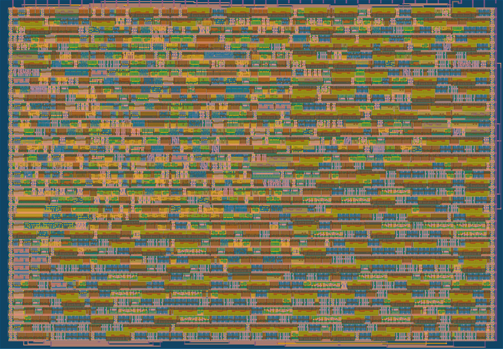

  

# PS/2 Keyboard to Morse Code Encoder
The aim of this project is to design my own ASIC.
The project was implemented during a course at Johannes Kepler University Linz ([JKU](https://www.jku.at/)).
The chip is produced as part of the [Tiny Tapeout](https://tinytapeout.com) project.

A Morse code encoder was chosen as the design for the chip. For this, the output of a [PS/2](https://en.wikipedia.org/wiki/PS/2_port) keyboard is evaluated,
if a key is pressed on the keyboard, the input is stored in a 12-bit temporary buffer.
All alphanumeric characters are supported, except for umlauts and numbers on the number pad.
The output of the design depends on the selected mode.
Mode 1 is activated with the F1 key and is the default mode after a reset.
In this mode, the contents of the buffer are output when the enter key is pressed.
Mode 2 can be activated with the F4 key. If this mode is active, the content of the buffer is output as soon as the space bar is pressed.
The Morse code output consists of dots (dits) and dashes (dahs).
The timings for dits, dahs, symbol spacing and spaces have been selected so that a Morse signal with approx. 15 WPM (words per minute) is generated.
The design has four outputs. Dit and dah each have their own output.
A further output is a combination of dit and dah. This output is active when a dit or dah is being output.
The last output is intended for connecting a buzzer or a small speaker. This output emits a 600Hz square wave signal when either a dit or a dah is output.

## Silicon
The chip is produced as part of the Tiny Tapeout project it will take part in TT06.
The design requires a 1x1 tile and achieves a utilization of approx. 81%, for which approx. 1500 logic cells (excluding fill and tap cells) are required.

## Code
This project is written in Verilog. It's my first Verilog project, so forgive me for possible bugs and inefficient code.
The design includes three separate modules.
One module for decoding the PS/2 data from the keyboard that evaluates the data sent by the keyboard.
Another module generates the Morse code output based on the keyboard input, and one additional module generates the 600Hz square wave signal.
Across the modules, multiple finite state machines (FSM) are used.
The exact implementation and a test bench can be found in the [src](https://github.com/byte-me404/jku-tt06-ps2-morse-encoder/tree/main/src) folder.

## How to Test the Design
### Required Hardware
To test the design, a PS/2 keyboard is needed.
It is important to use a logic converter (5V to 3.3V) for the data and clock line, as the Tiny Tapeout chip only supports 3.3V!
Connect the data line to `ui_in[1]` and the clock line to `ui_in[0]`.
Additionally, two pull-up resistors (5kΩ) against 5V must be connected to the two lines.
Don't forget to supply the keyboard with 5V and GND. 
If you don't have a PS/2 keyboard, you can also use a USB keyboard. Some, but not all, USB keyboards still support the PS/2 protocol.
In this case, D+ is clock and D- is data (don't forget the pull-up resistors and the level shifter).

After everything is connected, perform a reset and start typing on the keyboard.
The input should be stored in a buffer (max. 14 characters). With F1 and F4, you can switch between two modes.
Mode 1 (F1) is the default mode. In this mode, the characters stored in the buffer are output when enter is pressed on the keyboard.
Mode 2 (F4) outputs the buffer as soon as the space bar is pressed.
It is worth noting that no new characters can be entered during output.
Segment A of the seven-segment display lights up when a dit is output, segment D lights up when a dah is output.
Segment G lights up when a dit or a dah is output. A buzzer can be connected to output `uo_out[7]` (segment DP) which emits the Morse code as a tone (600 Hz).
Before submission to TT06 the design was tested on a Spartan 3AN Starter Kit, so it should work (hopefully 😅).

PS: You may be surprised when you press the F6 key 🐣🐰

## What is Tiny Tapeout?
[Tiny Tapeout](https://tinytapeout.com) is an educational and open source project that aims to make it easier and cheaper than ever to get your digital designs manufactured on a real chip.
